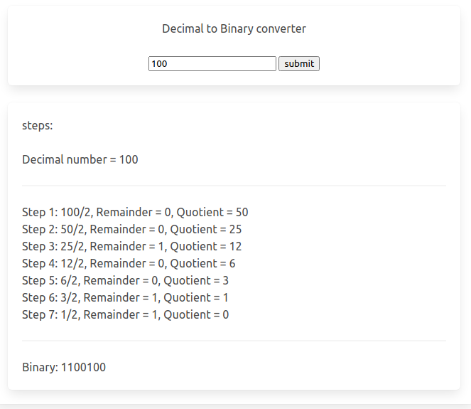
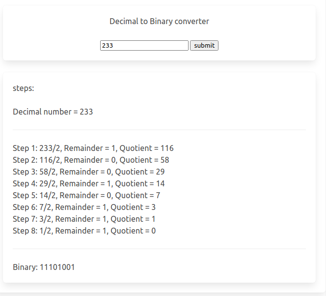

</img>
</img>

### what i learned from it

#### DOM manipulation
##### how to create an place HTML element using Javascript
1. create a constant referring to type of the element
2. give the element a class (optional)
3. give the element content (optional)
4. add the element to a parent element

##### calling one function inside another